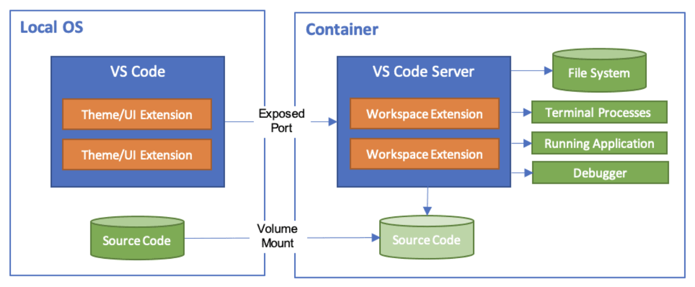

# DevContainer (Node.js + Vue.js)

### Architecture of DevContainer
</img>

###### Vue 프로젝트 만들기

```
vue -V

vue create 프로젝트명

cd 프로젝트명

yarn serve --port 80 --open
```

### YouTube Link

[](https://youtu.be/CcRZk3CSE5o)
